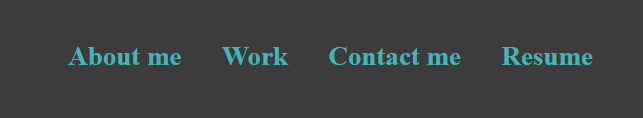
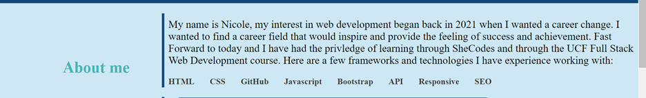
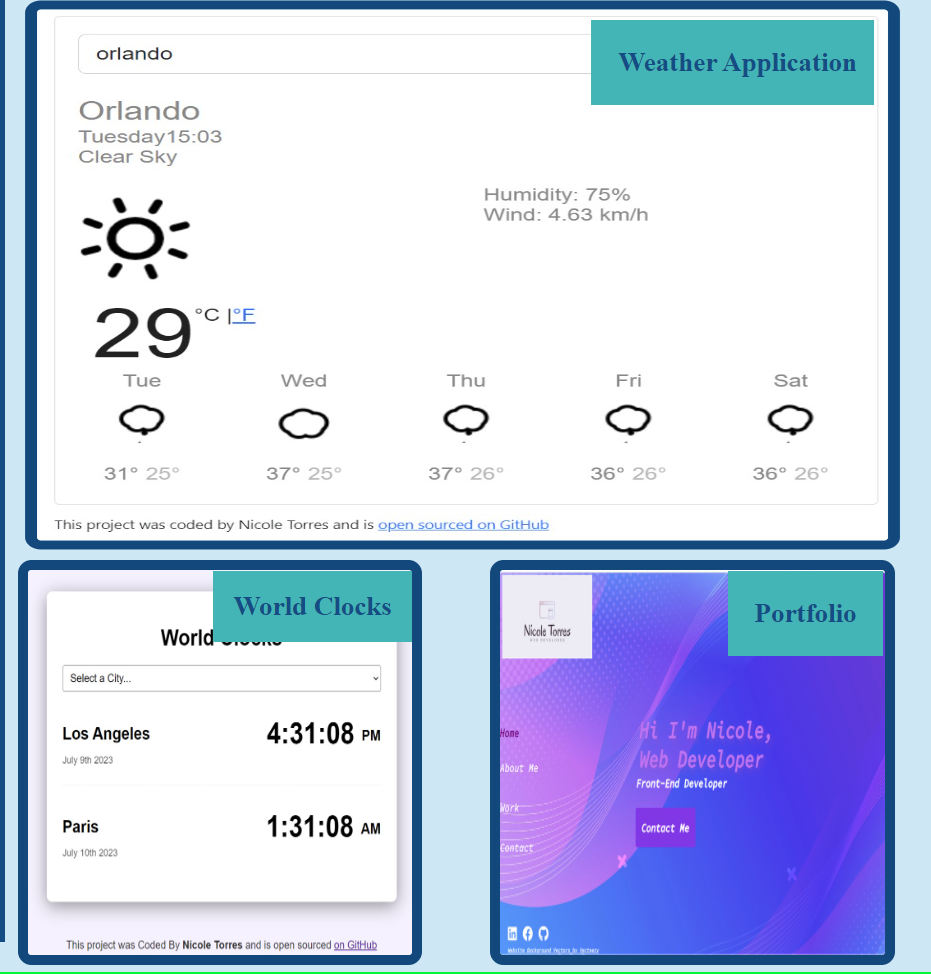
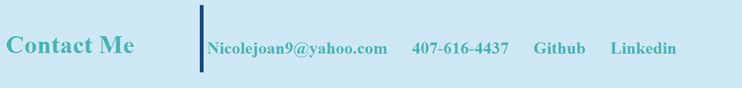

# NT-Developer-Portfolio

# React + Vite

This template provides a minimal setup to get React working in Vite with HMR and some ESLint rules.

Currently, two official plugins are available:

- [@vitejs/plugin-react](https://github.com/vitejs/vite-plugin-react/blob/main/packages/plugin-react/README.md) uses [Babel](https://babeljs.io/) for Fast Refresh
- [@vitejs/plugin-react-swc](https://github.com/vitejs/vite-plugin-react-swc) uses [SWC](https://swc.rs/) for Fast Refresh

## Description

This webpage was created to provide information on Nicole Torres and her experience with different frameworks and languages as well as showcase the projects she has completed utilizing the frameworks and languages.

## Table of Contents
- [Description](#description)
- [Badges](#badges)
- [Usage](#usage)
- [License](#license)
- [References](#references)
- [GitHub-repository](#github-repository)
- [Deployed-application-link](#deployed-application-link)

## Badges

## Usage

To use this webpage you can click on the diffrent links in the navigation bar that will jump your screen to the selected section of the page (About me, Work , Contact me , and Resume).

The About section gives further information as to why Nicole chose Web Development and the frameworks she's learned.

The projects Nicole has completed are laid out in an easily readable format which can be accessed via clicking either on the image itself or the project name. Once clicked a new tab will open with the corresponding project to view.

There are 4 links provided that once clicked will open a separate tab to view the corresponding page chosen. Each link will give access to different contact information and webpages that host the successful webpages that have been deployed along with the codes.

## License

## References
- Images used from freepik
<a href="https://www.freepik.com/free-vector/background-realistic-abstract-technology-particle_6938839.htm#query=website%20background&position=7&from_view=keyword&track=ais">Freepik</a>

- <a href="https://storyset.com/work">Work illustrations by Storyset</a>

## GitHub-repository
https://github.com/NicoleT27/NT-Developer-Portfolio

## Deployed-application-link
https://nt-portfolio-8c4622b0c7ab.herokuapp.com/
